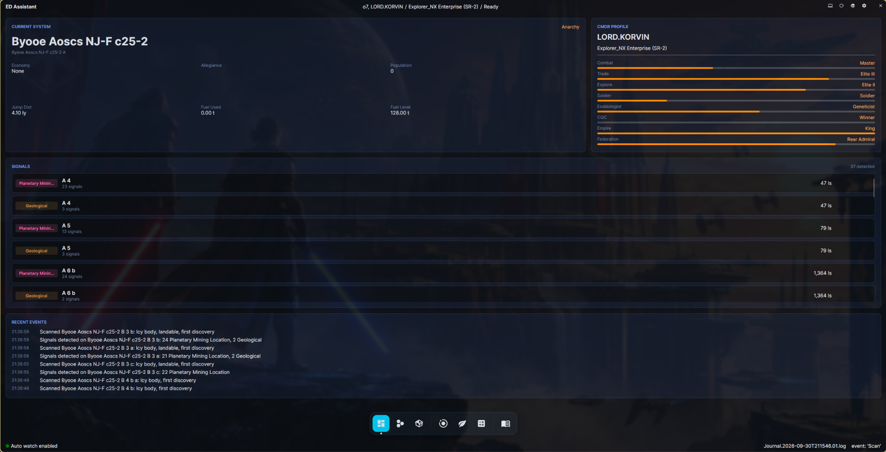
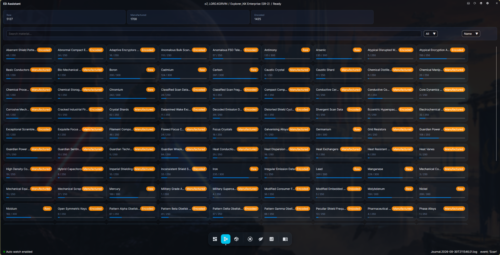
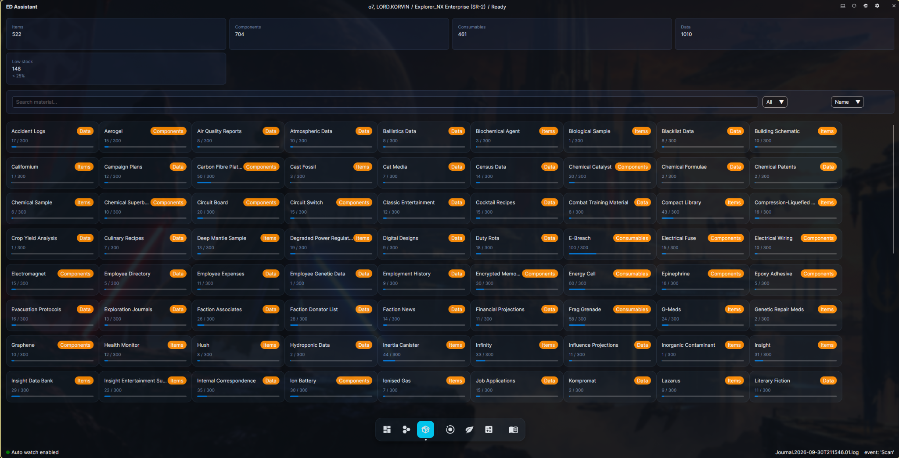
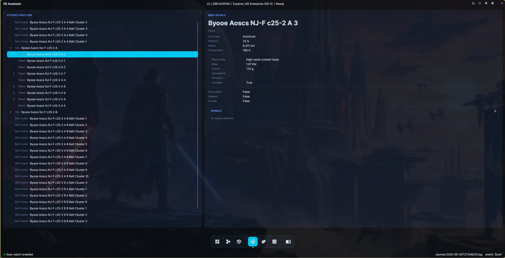
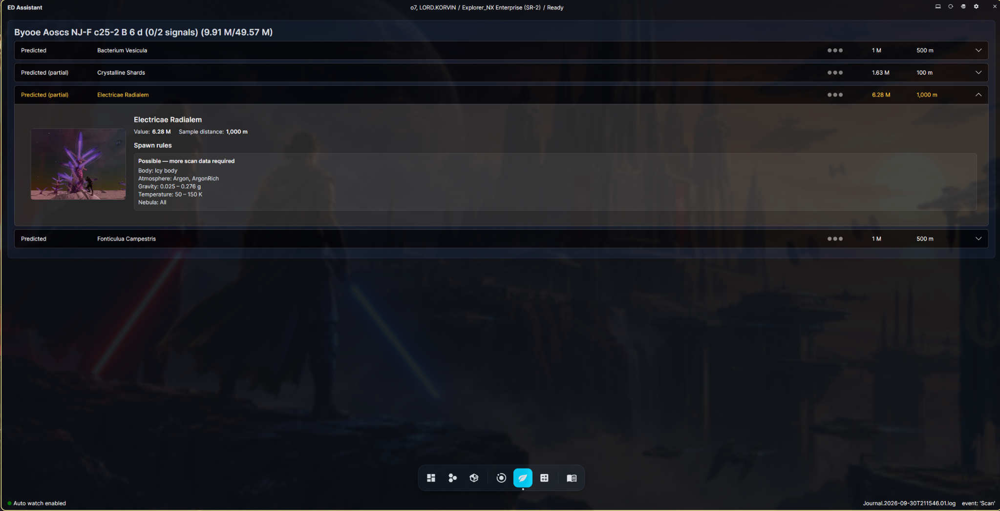
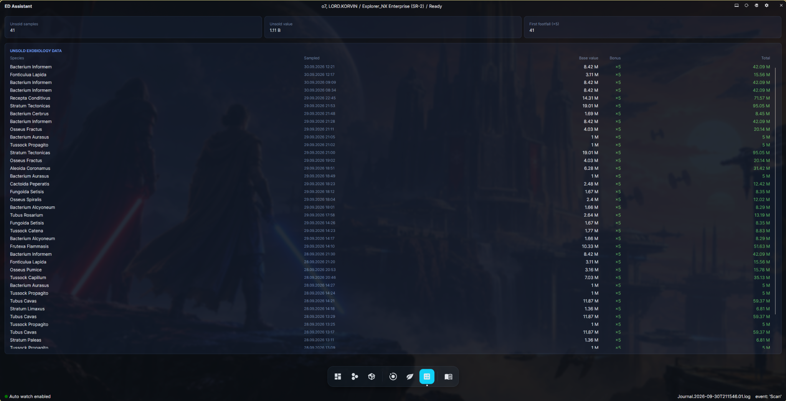
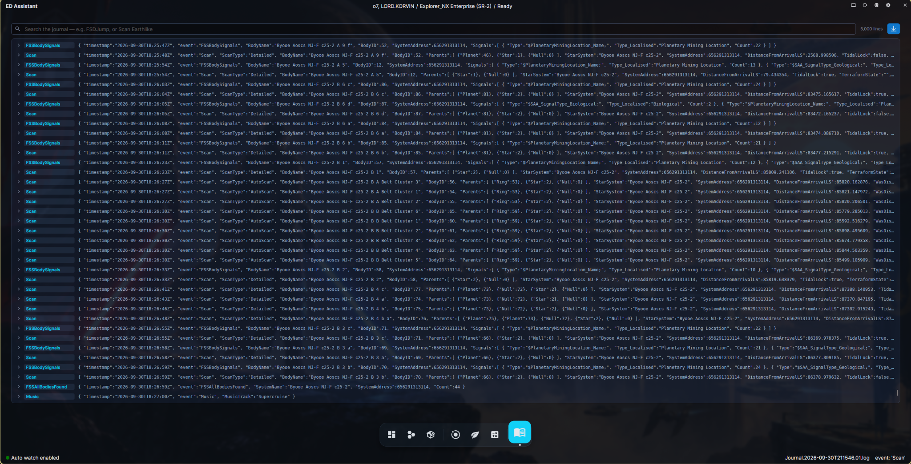
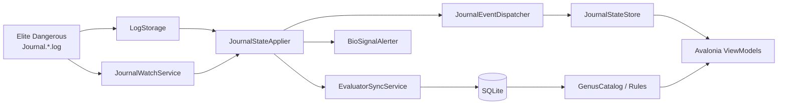

# ED Assistant

A modern desktop companion for **Elite Dangerous** focused on live journal monitoring, exploration, exobiology, materials, Odyssey inventory, system inspection, and unsold biological sample tracking.

[](https://dotnet.microsoft.com/)
[](https://avaloniaui.net/)
[](#platform-support)
[](https://github.com/IgorBabayan/ed-assistant/actions/workflows/build.yml)

> **ED Assistant is an unofficial community project and is not affiliated with Frontier Developments.**

<p align="center">
  
</p>

## Contents

- [Overview](#overview)
- [Features](#features)
- [Screenshots](#screenshots)
- [How it works](#how-it-works)
- [Exobiology prediction engine](#exobiology-prediction-engine)
- [Evaluator and unsold biological data](#evaluator-and-unsold-biological-data)
- [Journal events currently used](#journal-events-currently-used)
- [Installation](#installation)
- [First-run configuration](#first-run-configuration)
- [Platform support](#platform-support)
- [Build from source](#build-from-source)
- [Project architecture](#project-architecture)
- [Database and migrations](#database-and-migrations)
- [Plugin system](#plugin-system)
- [Linux integration](#linux-integration)
- [CI and releases](#ci-and-releases)
- [Known limitations](#known-limitations)
- [Contributing](#contributing)
- [License](#license)

## Overview

ED Assistant reads the journal files produced by Elite Dangerous and turns them into a continuously updated desktop interface.

The application keeps a shared in-memory representation of the current commander, ship, system, scanned bodies, FSS/DSS signals, materials, ship-locker contents, ranks, recent journal events, and collected biological samples. Views subscribe to that state and update when new journal lines arrive.

A local SQLite database adds persistent data that does not naturally live in the current journal state. It stores the exobiology rule catalog used by the prediction engine and the **Evaluator** history used to track unsold biological samples across sessions.

The current application is built with:

- **.NET 10**
- **Avalonia UI 12.1.3**
- **CommunityToolkit.Mvvm**
- **Entity Framework Core 10**
- **SQLite**
- **Microsoft.Extensions.DependencyInjection**
- **Microsoft.Extensions.Caching.Memory**
- **Material.Icons.Avalonia**

The repository's default branch is `development`. The release workflow runs from `master`.

## Features

| Area | What ED Assistant provides |
| --- | --- |
| **Dashboard** | Current system information, commander profile, rank progression, detected system signals, and recent noteworthy journal events. |
| **Materials** | Raw, Manufactured, and Encoded engineering materials with totals, capacity bars, search, category filters, and sorting. |
| **Ship Locker** | Odyssey Items, Components, Consumables, and Data with totals, low-stock summary, search, category filters, and sorting. |
| **System** | Hierarchical system structure built from scan parent relationships, body details, discovery/mapping state, and detected signals. |
| **Exobiology** | Biological signal tracking, species predictions, partial predictions, DSS/sample exclusions, sample progress, biological values, genetic sample distance, images, and expandable spawn-rule details. |
| **Evaluator** | Persistent list of unsold exobiology samples, estimated payout, first-footfall bonus tracking, sale detection, and historical journal import. |
| **Journal** | Live raw-journal viewer with event labels, search, follow mode, and a bounded 5,000-line in-memory buffer. |
| **Live watch** | Incremental monitoring of `Journal.*.log` with safe handling of partially written journal lines and log rotation. |
| **Notifications** | Biological-signal alerts in the app and through platform desktop notifications. |
| **Plugins** | Runtime-loaded plugins can register services and add pages to the application dock. |
| **Cross-platform paths** | Windows journal discovery plus Linux/Proton Steam-library discovery, including additional Steam libraries. |
| **Configurable dock** | Bottom, left, or right navigation dock. |

## Screenshots

### Dashboard

The dashboard combines commander and ship state with current-system information, rank progression, system signals, and recent exploration activity.

<p align="center">
  
</p>

### Engineering materials

Materials are grouped into **Raw**, **Manufactured**, and **Encoded** categories. Each card shows current stock against its category capacity, while the toolbar provides search, category filtering, and sorting.

<p align="center">
  
</p>

### Odyssey ship locker

The ship-locker page presents **Items**, **Components**, **Consumables**, and **Data** in the same compact inventory style. A low-stock summary highlights entries below 25% of capacity.

<p align="center">
  
</p>

### System structure

The System page reconstructs the scanned hierarchy of stars, planets, rings, barycentres, and belt clusters. Selecting a body opens its scan data and known signals.

<p align="center">
  
</p>

### Exobiology

The Exobiology page combines journal observations with the local biological rule catalog.

It can show:

- confirmed biological samples;
- predicted species;
- **Predicted (partial)** entries when required scan data is still missing;
- species excluded after DSS genus identification;
- species excluded after a sample confirms another species of the same genus;
- base biological value;
- genetic sample distance;
- sample progress;
- first-footfall-adjusted value estimates;
- biological images from `Assets/Biology`;
- expandable spawn conditions and their current match state.

<p align="center">
  
</p>

### Evaluator

Evaluator persists biological samples beyond the current system and shows the value of data that has not yet been sold.

<p align="center">
  
</p>

### Raw journal

The Journal page is useful when debugging the game state or checking exactly what Elite Dangerous wrote. Search terms are space-separated and all terms must match the raw line.

<p align="center">
  
</p>

## How it works

At a high level, journal data flows through the application like this:



### Initial load

`JournalLoaderService` loads recent journal files from the configured folder. The default is the last **5 days**, and `0` means all journals in the folder.

The loader:

1. resolves the log folder;
2. pauses the live watcher if necessary;
3. parses the selected journal history;
4. synchronizes pending Evaluator changes to SQLite;
5. publishes the new `JournalState`;
6. resumes the watcher.

### Live journal monitoring

`JournalWatchService` uses `FileSystemWatcher` and a bounded channel to coalesce file notifications.

Important implementation details:

- only newly appended bytes are read;
- file rotation is supported;
- a short delay allows game writes to settle;
- a line is only processed after its terminating newline exists;
- bytes belonging to an incomplete final line are re-read on the next update;
- published state is copied before mutation, so UI readers are not enumerating a state being changed by the watcher.

### Dispatch and aggregation

`JournalStateApplier` creates a dispatcher and an aggregator for each load batch.

The dispatcher reads the journal `event` field once, deserializes only subscribed event types, and invokes typed handlers.

The aggregator then keeps either:

- the latest occurrence of singleton-like events such as `Commander`, `LoadGame`, `Materials`, `Rank`, and `ShipLocker`; or
- keyed collections for body and system data such as `Scan`, `FSSBodySignals`, `SAASignalsFound`, and `BaryCentre`.

When the commander changes system, system-specific caches are cleared.

## Exobiology prediction engine

One of the main goals of ED Assistant is to provide useful biological information **before every species is confirmed by a sample**.

The local database contains biological species and one or more spawn rules for each species. `BiologyRuleMatcher` evaluates those rules against the journal data available for the current body and system.

### Conditions currently evaluated

The matcher can use:

- planet/body class;
- atmosphere type;
- surface gravity;
- surface temperature;
- surface pressure;
- volcanism;
- atmospheric component percentages;
- maximum orbital period;
- presence of required body classes elsewhere in the system;
- star class;
- parent-star class;
- stellar luminosity class.

Some rule fields cannot always be resolved from the currently retained journal state. Guardian, nebula, and parent-body-class requirements can therefore leave a rule in a **Possible** state rather than rejecting it.

### Match states

A rule produces one of three outcomes:

| State | Meaning |
| --- | --- |
| **Matched** | Every condition that applies can be evaluated and matches current scan data. |
| **Possible** | No evaluated condition rejects the rule, but some required information is still missing. |
| **Rejected** | At least one known condition does not match. |

The UI renders possible entries as **Predicted (partial)** and explains that more scan data is required.

### DSS and biological samples refine predictions

Prediction is intentionally conservative.

After DSS data identifies genera on a body, a predicted species can be marked **Excluded by DSS** when its genus is demonstrably absent.

After a biological sample confirms one species, alternative species belonging to that same genus can be marked **Excluded by sample**.

Predictions shown before DSS are retained while the commander continues to gather scan data so the display does not unexpectedly lose useful candidates just because the set of currently evaluable fields changed.

### Values and first footfall

The exobiology UI displays species base values and calculates an estimated value range for incomplete planets.

For fully collected biological data, the code applies the Elite Dangerous first-footfall multiplier used by the Evaluator:

```text
First-footfall multiplier = ×5
```

Multiple candidate species from the same genus are treated as alternatives for one biological signal when calculating a value range.

### Biological image assets

Species artwork is stored under:

```text
ED.Assistant/Assets/Biology/<Type>/<id>.webp
```

The project already contains biology asset folders for the supported families, including Aleoida, Bacterium, Brain Tree, Cactoida, Clypeus, Concha, Electricae, Fonticulua, Frutexa, Fumerola, Fungoida, Osseus, Recepta, Crystalline Shard, Stratum, Tuber/Tubus, and Tussock.

## Evaluator and unsold biological data

Evaluator is backed by SQLite rather than only by the current in-memory journal state.

When a biological sample is detected, `JournalStateApplier` records a pending Evaluator change. `EvaluatorSyncService` then resolves the species against the biological catalog and creates a persistent row containing information such as:

- species/genus;
- sample timestamp;
- system address;
- body ID;
- whether first footfall applied;
- calculated total value;
- active/sold state;
- sale timestamp.

### Duplicate protection

Historical reloads and imports can encounter the same sample more than once. Evaluator protects against duplicate rows by checking both:

- the same species and event timestamp; and
- the same species on the same system/body while the previous row is still unsold, or was sold only after the historical sample occurred.

This allows an actually new sample collected after an older copy was sold to be recorded normally.

### Detecting sales

The `SellOrganicData` journal event is used to mark matching active Evaluator rows as sold. Sale replay is also handled idempotently so re-reading the same journal does not consume more rows than the original sale contained.

### Importing older journals

The application can import a folder of historical Elite Dangerous journals.

Import mode reads **all** matching journal files in that folder, synchronizes their sample/sale history into the database, and reports how many new unsold samples were added.

## Journal events currently used

The state pipeline currently has typed support for the following major events:

| Journal event | Main use |
| --- | --- |
| `Commander` | Commander identity. |
| `LoadGame` | Ship information and session state. |
| `Rank` | Commander rank cards on the dashboard. |
| `Materials` | Engineering materials inventory. |
| `ShipLocker` | Odyssey inventory. |
| `FSDJump` | Current system and system-state reset. |
| `Location` | Current location when not represented by a jump. |
| `CarrierJump` | Handled through the location path. |
| `Scan` | Stars and body scan properties used by System and Exobiology. |
| `BaryCentre` | System hierarchy reconstruction. |
| `FSSBodySignals` | Geological, biological, mining, and related body signals. |
| `SAASignalsFound` | DSS signals and biological genus information. |
| `FSSSignalDiscovered` | System-level FSS signal tracking. |
| `ScanOrganic` | Biological sample progress and Evaluator sample creation. |
| `SellOrganicData` | Marks matching biological samples as sold in Evaluator. |

The raw Journal page is not limited to these display concepts: it retains the processed raw lines themselves for inspection.

## Installation

### Pre-built releases

The GitHub Actions workflow produces self-contained builds, so users of those packages do **not** need to install the .NET runtime separately.

Open the repository's **Releases** page:

```text
https://github.com/IgorBabayan/ed-assistant/releases
```

The automated `latest` pre-release contains:

- `ED.Assistant-<version>-win-x64.zip`
- `ED.Assistant-<version>-x86_64.AppImage`

### Linux AppImage

```bash
chmod +x ED.Assistant-*-x86_64.AppImage
./ED.Assistant-*-x86_64.AppImage
```

On Linux the app also has built-in support for creating an `ed-assistant.desktop` launcher and installing its icon into the user's local icon directory.

### Windows

Extract the `win-x64.zip` archive and run:

```text
ED.Assistant.exe
```

The repository also contains an Inno Setup definition under `installer/ED.Assistant.iss`, although the current GitHub build workflow publishes the ZIP package rather than an installer executable.

## First-run configuration

Open **Settings** from the application shell to configure:

- **Log folder**
- **Dock position**
- **Read logs from the last days**
  - default: `5`
  - `0` = read all available journals
- **Enable auto watch log files**
- **Hide excluded signals**

### Journal folder discovery

#### Windows

ED Assistant uses the standard Elite Dangerous journal location:

```text
%USERPROFILE%\Saved Games\Frontier Developments\Elite Dangerous
```

#### Linux / Steam Proton

ED Assistant searches Steam libraries for Elite Dangerous AppID `359320` and resolves the Proton journal path:

```text
<SteamLibrary>/steamapps/compatdata/359320/pfx/drive_c/users/steamuser/
Saved Games/Frontier Developments/Elite Dangerous
```

Known Steam roots include:

```text
~/.steam/steam
~/.local/share/Steam
~/.var/app/com.valvesoftware.Steam/.local/share/Steam
~/snap/steam/common/.local/share/Steam
```

Additional libraries listed in `steamapps/libraryfolders.vdf` are also inspected.

You can always override automatic discovery by selecting another log folder in Settings.

### Local application data

Typical locations are:

| Data | Windows | Linux |
| --- | --- | --- |
| Config | `%LOCALAPPDATA%\ED Assistant\config.json` via the Windows resolver | application config directory, typically `~/.config/ed-assistant/config.json` |
| SQLite database | `%LOCALAPPDATA%\ED Assistant\bio-samples.db` | `~/.local/share/ED Assistant/bio-samples.db` |
| Plugins | `%APPDATA%\ed-assistant\plugins` | application-data directory, typically `~/.config/ed-assistant/plugins` |

> Exact values for .NET special folders can vary with environment variables such as `XDG_CONFIG_HOME` and `XDG_DATA_HOME`.

## Platform support

| Platform | Status | Notes |
| --- | --- | --- |
| **Windows x64** | Supported | Native journal path detection and Windows toast notifications. |
| **Linux x64** | Supported | Steam/Proton journal discovery, AppImage build, desktop-file creation, Hyprland integration, and `notify-send` fallback. |
| **macOS** | Incomplete | Notification code exists, but the current `MacPathResolver` still throws `NotImplementedException` for log/config discovery. |

The automated workflow currently builds **Windows x64** and **Linux x64** artifacts.

## Build from source

### Requirements

- **.NET SDK 10.0**
- Git
- A desktop environment supported by Avalonia

Clone the repository:

```bash
git clone https://github.com/IgorBabayan/ed-assistant.git
cd ed-assistant/ED.Assistant
```

Restore and build:

```bash
dotnet restore
dotnet build
```

Run:

```bash
dotnet run --project ED.Assistant.csproj
```

### Release-style publish

Linux x64:

```bash
dotnet publish ED.Assistant.csproj \
  -c Release \
  -r linux-x64 \
  --self-contained true \
  -o publish/linux-x64
```

Windows x64:

```bash
dotnet publish ED.Assistant.csproj \
  -c Release \
  -r win-x64 \
  --self-contained true \
  -p:PublishSingleFile=true \
  -p:IncludeNativeLibrariesForSelfExtract=true \
  -o publish/win-x64
```

## Project architecture

The project is intentionally split into application, domain/data, and presentation concerns.

```text
ed-assistant/
├── .github/
│   └── workflows/
│       └── build.yml
├── ED.Assistant/
│   ├── App/
│   │   ├── App.axaml
│   │   ├── App.axaml.cs
│   │   └── Program.cs
│   ├── Application/
│   │   ├── Catalog/
│   │   ├── Dialog/
│   │   ├── Evaluation/
│   │   ├── JournalLoading/
│   │   ├── Linux/
│   │   ├── Navigation/
│   │   ├── Notifications/
│   │   ├── Path/
│   │   ├── Plugins/
│   │   ├── Settings/
│   │   ├── State/
│   │   └── Storage/
│   ├── Assets/
│   │   └── Biology/
│   ├── Data/
│   │   ├── Configuration/
│   │   ├── Evaluator/
│   │   ├── Repository/
│   │   ├── Seed/
│   │   │   └── ExoBiology/
│   │   └── Storage/
│   ├── Domain/
│   │   ├── Config/
│   │   ├── DTO/
│   │   ├── Enums/
│   │   ├── Events/
│   │   ├── System/
│   │   └── Types/
│   ├── Extensions/
│   ├── Migrations/
│   ├── Plugins/
│   └── Presentation/
│       ├── Collections/
│       ├── Converters/
│       ├── Helpers/
│       ├── Styles/
│       ├── ViewModels/
│       └── Views/
└── installer/
    └── ED.Assistant.iss
```

### Application layer

The `Application` directory owns behavior that coordinates the rest of the program:

- journal loading and watching;
- typed journal dispatch;
- state application;
- navigation;
- dialogs and folder selection;
- settings storage;
- platform path resolution;
- Evaluator synchronization/import;
- notifications;
- plugin context;
- Linux desktop integration.

### Domain layer

`Domain` contains journal event models, enums, DTOs, system-structure models, application config, and shared domain types.

The journal models map Frontier journal JSON fields with `System.Text.Json`.

### Data layer

`Data` contains:

- `AppDbContext`;
- EF Core entity configurations;
- biological seed data;
- Evaluator persistence;
- generic repository and unit-of-work abstractions;
- database path resolution.

### Presentation layer

The UI follows MVVM:

```text
View (AXAML)
   ↕ binding
ViewModel
   ↕
Application services / JournalStateStore / SQLite
```

`CommunityToolkit.Mvvm` provides observable properties and relay commands.

Most main pages derive from `LoadableViewModel`, allowing them to react to journal-state updates while avoiding unnecessary work when a page is not visible.

## Database and migrations

ED Assistant uses an EF Core SQLite database named:

```text
bio-samples.db
```

`AppDbContext` contains the biological rule catalog plus Evaluator rows.

### Main biological entities

The current schema includes concepts such as:

- `Genus`
- `Rule`
- `BodyClass`
- `Atmosphere`
- `AtmosphereComponentRule`
- `Volcanism`
- `StarClass`
- `RuleStar`
- `ParentBodyClass`

The seed code currently contains data for biological groups including:

- Aleoida
- Anemone
- Bacterium
- Brain Tree
- Cactoida
- Clypeus
- Concha
- Crystalline Shards
- Electricae
- Fonticulua
- Frutexa
- Fumerola
- Fungoida
- Osseus
- Recepta
- Stratum
- Tubers
- Tubus
- Tussock

### Automatic migrations

Database migrations are applied automatically during application startup:

```csharp
dbContext.Database.Migrate();
```

This means an installed user normally does not need to run `dotnet ef database update` manually.

### Creating a migration during development

From `ED.Assistant/`:

```bash
dotnet ef migrations add <MigrationName>
```

Then inspect the generated migration before committing it.

The project contains `IDesignTimeDbContextFactory<AppDbContext>`, so EF tooling can create the database context outside the running Avalonia application.

## Plugin system

ED Assistant contains a small runtime plugin API.

Plugins are discovered below:

```text
<application-data>/ed-assistant/plugins/
```

A plugin directory is expected to look like:

```text
plugins/
└── MyPlugin/
    ├── MyPlugin.dll
    └── ...additional plugin files...
```

The DLL name must match its containing directory.

A plugin implements `IPlugin`:

```csharp
public interface IPlugin
{
    string Id { get; }
    string Name { get; }
    Version Version { get; }

    void ConfigureServices(
        IServiceCollection services,
        IPluginContext context);

    IEnumerable<PluginPage> GetPages();
}
```

`ConfigureServices` can register plugin services and page view models in the application's DI container.

Each plugin receives:

```text
PluginDirectory  -> read plugin-owned files
DataDirectory    -> writable persistent directory for the plugin
```

Writable plugin data is created under:

```text
plugins/_data/<plugin-id>/
```

Pages returned by `GetPages()` are appended to the main dock.

A page view model implements `IPluginPageViewModel` and receives a lightweight journal snapshot when the application's journal state changes:

```csharp
public interface IPluginPageViewModel
{
    Task OnJournalChangedAsync(
        PluginJournalSnapshot snapshot,
        CancellationToken ct);

    void OnNavigatedTo() { }
    void OnNavigatedFrom() { }
}
```

## Linux integration

Linux support includes a few project-specific conveniences.

### Hyprland

When `HYPRLAND_INSTANCE_SIGNATURE` is present:

- Avalonia uses managed system dialogs;
- biological desktop notifications are sent through `hyprctl notify`.

Outside Hyprland, Linux notifications use:

```bash
notify-send
```

### Desktop launcher creation

The app can generate:

```text
~/.local/share/applications/ed-assistant.desktop
```

and installs its icon into the user's local hicolor icon tree.

When running as an AppImage, the generated launcher uses the `APPIMAGE` environment variable so the desktop entry points back to the AppImage itself.

## CI and releases

`.github/workflows/build.yml` runs on pushes to `master` and can also be started manually.

The workflow:

1. installs .NET 10;
2. reads `VersionPrefix` from the project;
3. creates a version in the form `1.0.<run-number>`;
4. publishes a self-contained Windows x64 build;
5. publishes a self-contained Linux x64 build;
6. packages Windows as ZIP;
7. builds a Linux AppImage;
8. uploads both as workflow artifacts;
9. replaces the GitHub `latest` pre-release with the new build.

## Known limitations

- **macOS path resolution is not implemented yet.**
- Exobiology prediction quality depends on both the local rule catalog and the scan information currently available in the journals.
- Some biological conditions such as Guardian/nebula/parent-body requirements can remain unresolved from the current state and are therefore represented as partial predictions rather than definitive matches.
- The current GitHub workflow produces Windows x64 and Linux x64 only.
- A prediction is an assistant to exploration, not a guarantee that a species will be present.

## Contributing

The default repository branch is `development`, so feature work should normally start from an up-to-date development branch.

A typical workflow is:

```bash
git checkout development
git pull
git checkout -b feature/my-change
```

Before opening a pull request:

```bash
dotnet restore
dotnet build
```

When changing the EF Core model, include the corresponding migration.

When changing exobiology data or matching rules, verify both:

- predicted species before full scan data is available; and
- exclusion/confirmation behavior after DSS and `ScanOrganic` events.

## License

A license file is not currently included in the repository. Add an explicit license before relying on redistribution or external contribution terms.

---

**Repository:** https://github.com/IgorBabayan/ed-assistant
